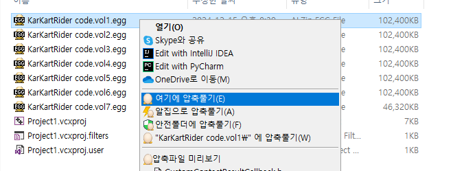
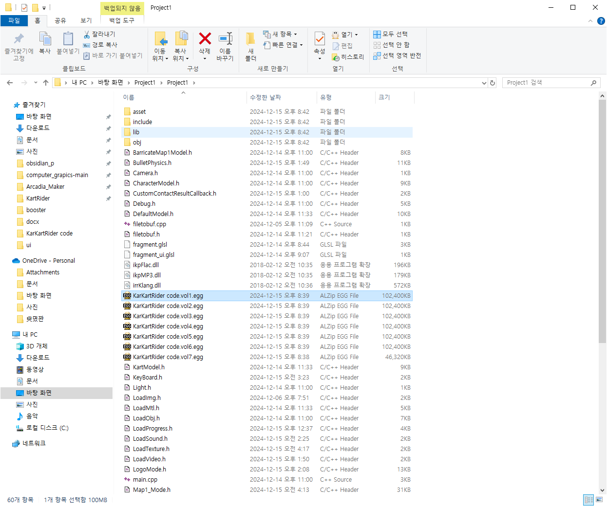
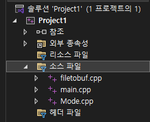
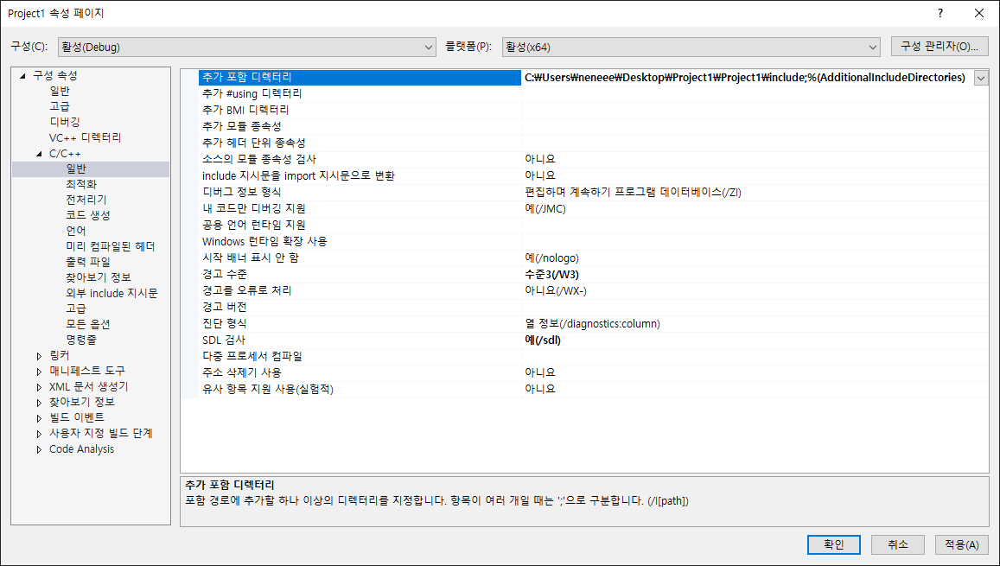
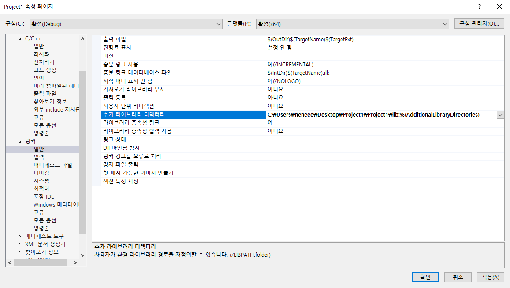
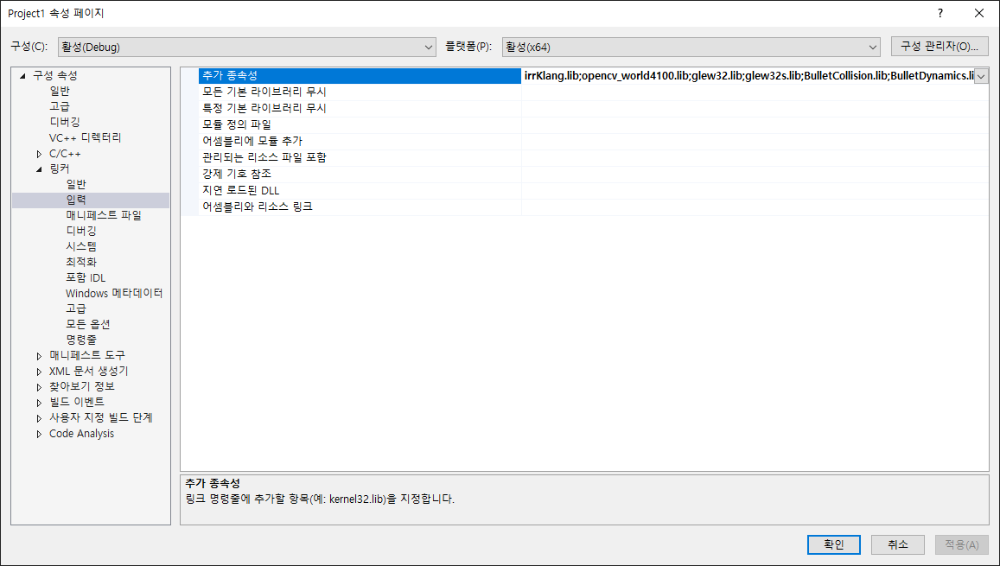
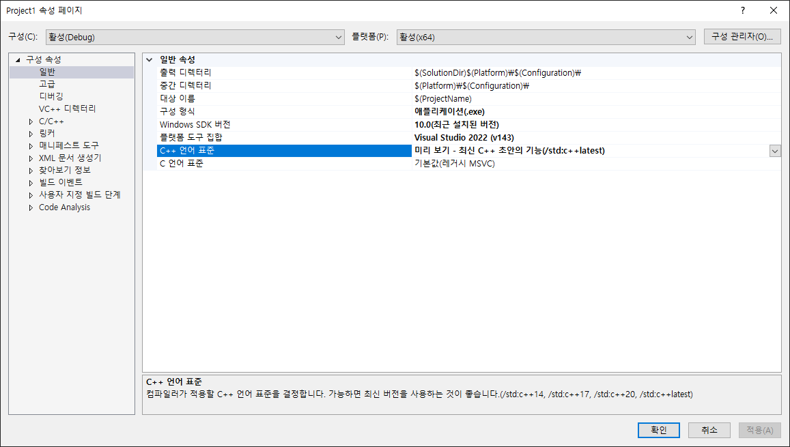
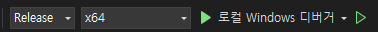

# KartRider
KartRider 모작, 컴퓨터 그래픽스 프로젝트

프로젝트 이름: 카트카트라이더(kart-kartRider)

팀: 2022180030 이소민(팀장), 2022180024 유영빈

카테고리: 레이싱, 

개발 기간: 11월 25일 ~ 12월 15일 (약 3주)

플랫폼: pc.

## 프로젝트 세팅 방법 (릴리스 모드)

1. 알집을 사용해서 vol1 번 파일을 풀어준다.

2. 새로운 프로젝트에 기존 파일 추가를 사용해서 3가지 cpp파일을 넣어준다.

3. 프로젝트 속성 -> c/c++ -> 일반 -> 추가 포함 디럭테러 -> include 폴더 선택

4. 프로젝트 속성 -> 링커 -> 일반 -> 추가 라이브러리 디렉터리 -> lib 폴더 선택

5. 프로젝트 속성 -> 링커 -> 입력 -> 추가 종속성 (다음 7개 추가)

irrKlang.lib

opencv_world4100.lib

glew32.lib

glew32s.lib

BulletCollision.lib

BulletDynamics.lib

LinearMath.lib

6. 반드시 c++ 버전 17 이상으로 선택

7. 릴리스 모드 x64 실행

AMD CPU일 경우 글자 안보일 수 있음!

## 명령어 안내
### <맵 선택 모드>

- 방향키(좌우) : 맵 선택
- Enter : 맵 선택 확정 

### <플레이 모드>
- 방향키(상하) : 카트 전진 및 후진
- 방향키(좌우) : 카트 회전
- Ctrl : 부스트 
- Esc : 일시정지(다시 시작, 맵 선택 화면(마우스로 클릭))
- p : 맵 선택 모드로 이동
- b: 바운딩박스 켜기/끄기
- q: 게임 종료
## 프로젝트 진행 사항
- 맵 : 2개(일자맵, 사각형 맵)
- 플레이어 : 카트 + 캐릭터 
	- 이동, 회전, 부스트, 물리 충돌
	- 카트 회전 및 부스터 사용 시 캐릭터의 얼굴이 치우침(관성 적용)
- 스테이지 : 
- 타이틀 화면 : 게임의 시작 지점
- 맵 선택 화면 : 플레이어가 원하는 맵 선택 가능
- 플레이(레이싱) : 실제 레이싱 진행
- 결과 화면 : 레이스 결과 출력
- 일시정지 : 레이싱 중 Esc 키로 접근 가능
- Ui : 
- 랩 타임 : 현재 랩 시간 표시
- 결과 타임 : 레이싱 끝난 후 레이싱 시간 표시
- 속도 : 카트의 현재 속도 표시
- 레이싱 시작 카운트다운 : 3, 2, 1, 시작 카운트 표시 후 레이싱 시작
